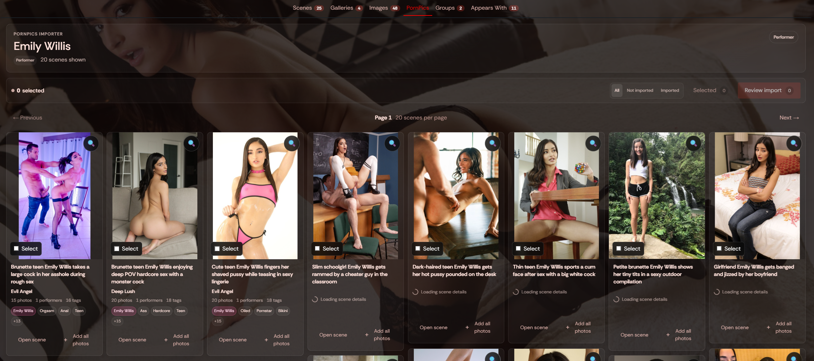
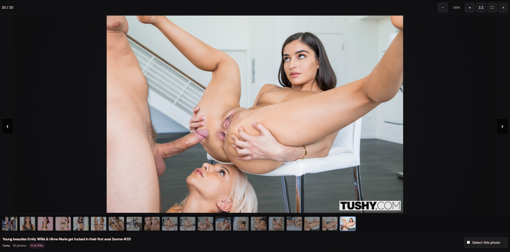
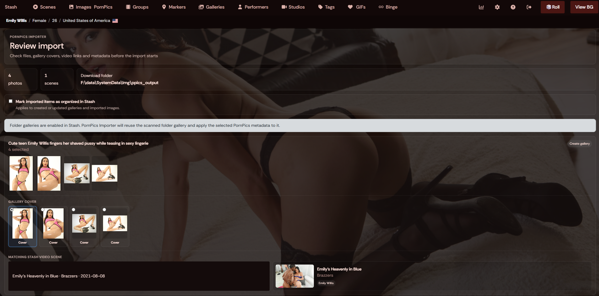
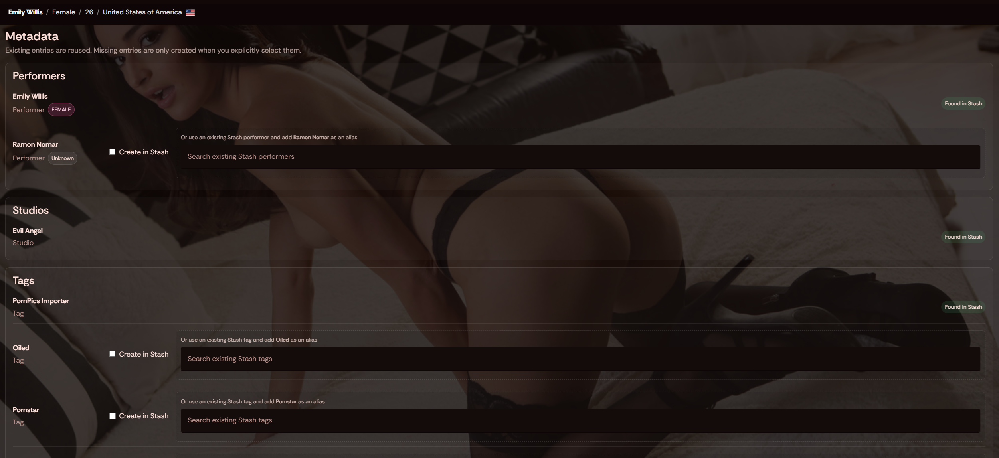
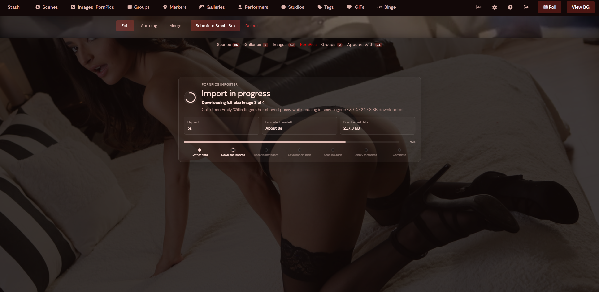
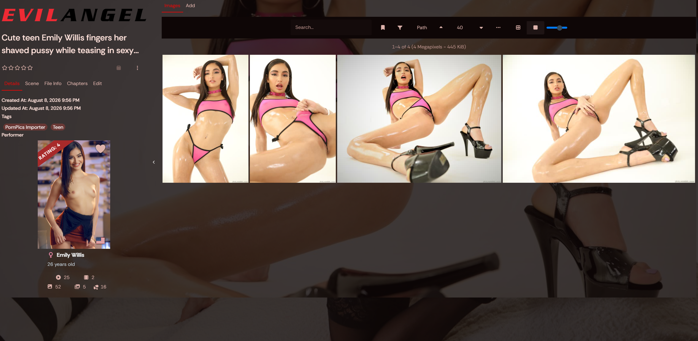
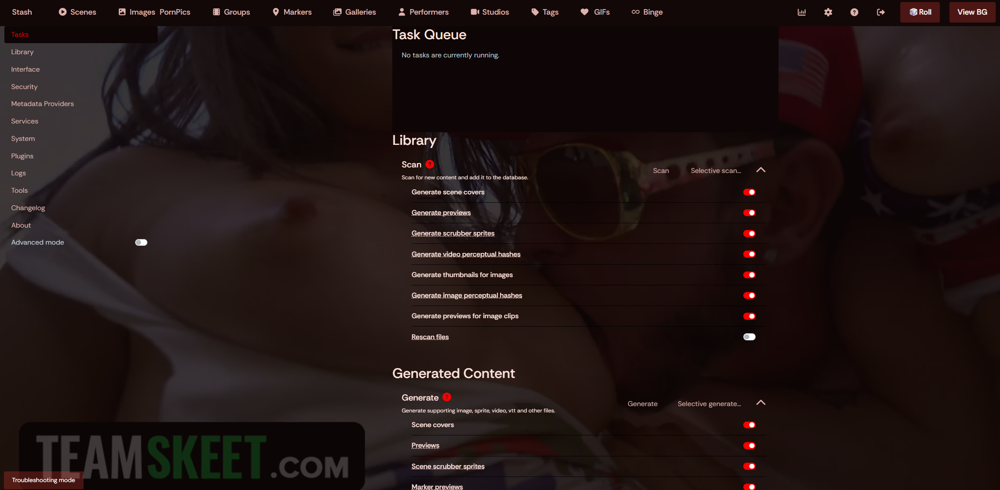
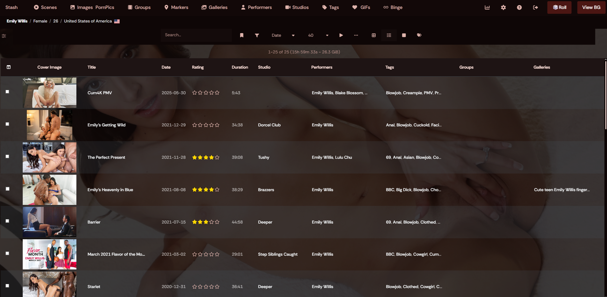
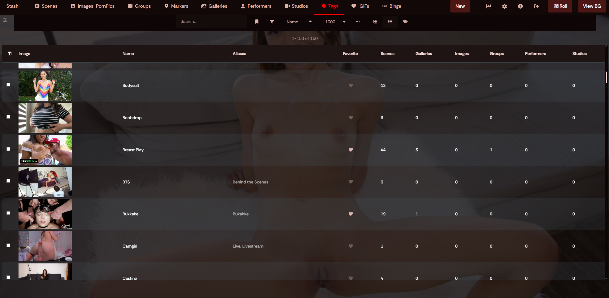

# Stash Plugins

A collection of my plugins for [Stash](https://stashapp.cc/) that add new browsing, importing, and customization features to your Stash instance.

---

## Installation

In Stash, go to:

**Settings → Plugins → Available Plugins → Add Source**

Add:

```text
https://bprpisync.github.io/stash/main/index.yml
```

After adding the source, refresh **Available Plugins** and install the plugin you want.

---

# PornPics Importer

> Browse PornPics.com from inside Stash, select the photos you want, review the metadata, and import full-size images directly into your library.



## What it does

PornPics Importer adds a complete PornPics browser to Stash.

You can search for performers, studios, tags, or scenes, open PornPics galleries without leaving Stash, select individual photos or entire galleries, review the metadata, and import the full-size images into your configured Stash library.

It also adds a **PornPics** tab to performer pages, so you can immediately browse matching PornPics galleries for the performer you are viewing.

### Highlights

- Global PornPics search inside Stash
- Search performers, studios, tags, and scene keywords
- Supports PornPics gallery, performer, studio/channel, tag, and category URLs
- Dedicated PornPics tab on Stash performer pages
- Full-screen spotlight viewer: Zoom, pan, keyboard navigation, thumbnails, and mobile swipe navigation
- Select individual photos or add an entire gallery at once
- Detects previously imported photos
- Detects files that were removed from the output folder
- Prevents duplicate imports across performer, studio, and tag searches
- Full metadata review before import
- Performer, studio, and tag matching
- Map PornPics metadata to existing Stash entities

- Optional gallery cover selection
- Optional linking to an existing Stash video scene
- Optional organized status
- Live import progress
- Manual cache and session reset tasks


## Browsing PornPics

Open **PornPics** from the main Stash navigation.

The search field accepts normal search terms such as:

```text
Pornstar
Studio
Category/tag
```

You can also paste a PornPics URL directly

## Performer integration

When viewing a performer in Stash, the plugin adds a **PornPics** tab alongside the normal performer tabs.

That view uses the same browser, selection, spotlight, imported-status, and import system as the global PornPics page.

## Easy searching

Use the image spotlight to easily preview images and select them for importing.



## Selecting photos

Open a PornPics scene to select individual images, or use **Add all photos** directly from the scene list.

Your current selection is available through the **Selected** button, where photos are grouped by scene.



## Review before import

Before anything is imported, PornPics Importer opens a review screen.

Depending on the gallery, you can review and adjust:

- Performers
- Studio
- Tags
- Existing Stash entity matches
- Metadata mappings
- Gallery cover
- Related Stash video scene
- Organized status

Missing PornPics performers, studios, and tags are **not silently created**. You decide whether to create them or map them to an existing Stash entity.



## Import progress

Imports show live progress while images are downloaded, scanned by Stash, and updated with metadata.

For larger selections the importer also shows an estimated time remaining.

If an individual image fails, the entire import does not have to fail. Successfully imported photos continue normally and failed photos can be retried afterward.



## Result

See the created gallery instantly after importing. All files are downloaded to the output folder you provide in plugin settings and automatically scanned into stash.



# Random Backgrounds

> Automatically change the Stash background using images from your own Stash library.



## What it does

Random Backgrounds changes the Stash background automatically while you browse.

Add the tag:

```text
background
```

to images you want the plugin to use.

The plugin queries Stash through GraphQL, finds images with the `background` tag, and chooses a background as you move through Stash.

It is also context-aware. Instead of always choosing a completely unrelated image, it can look at the page you are currently viewing and prefer relevant images for things such as:

- Performers
- Studios
- Groups
- Other supported Stash pages

This makes the background feel connected to the content you are browsing.





## How to use

1. Install **Random Backgrounds** from this plugin repository.
2. Choose images in your Stash library that you want to use as backgrounds.
3. Add the tag:

   ```text
   background
   ```

   to those images.

4. Add at least **2 background images**.
5. Browse Stash normally.

The background will automatically change as you navigate between pages.

Almost all themes are supported. If it does not work for you, please get in touch with me and I'll take a look!

## Why add multiple images?

The plugin is designed to rotate backgrounds instead of showing the same image everywhere.

Using several tagged images also gives the context-aware matching more options when you open a performer, studio, group, or another supported page.

The more images you have tagged, the better the plugin will function!

note: For the context-aware feature: You need to have content linked to the images for example for it to show on a performer page, the image needs a performer tag of that performer!
