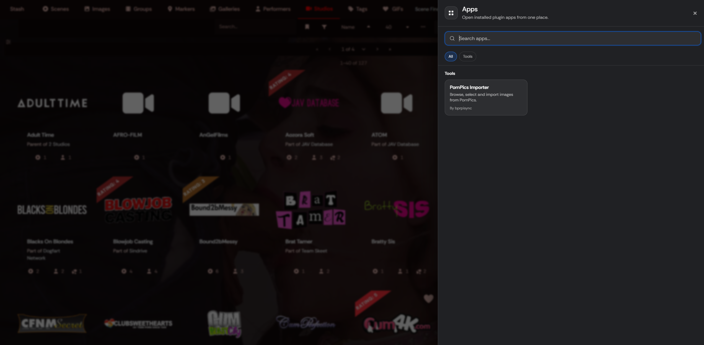
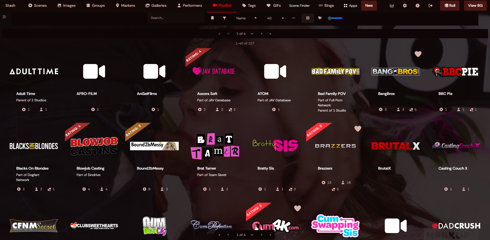

# Stash Plugins

A collection of my plugins for [Stash](https://stashapp.cc/) that add new browsing, importing, and customization features to your Stash instance.

---

## Installation

In Stash, go to:

**Settings → Plugins → Available Plugins → Add Source**

Add:

```text
https://bprpisync.github.io/stash/main/index.yml
```

After adding the source, refresh **Available Plugins** and install the plugin you want.

---

# PornPics Importer

> Browse PornPics.com from inside Stash, select the photos you want, review the metadata, and import full-size images directly into your library.


**Requires Stash App Drawer to be installed (install via the same index.yml above)**

## What it does

PornPics Importer adds a complete PornPics browser to Stash.

You can search for performers, studios, tags, or scenes, open PornPics galleries without leaving Stash, select individual photos or entire galleries, review the metadata, and import the full-size images into your configured Stash library.

It also adds a **PornPics** tab to performer pages, so you can immediately browse matching PornPics galleries for the performer you are viewing.

### Highlights

- Global PornPics search inside Stash
- Search performers, studios, tags, and scene keywords
- Supports PornPics gallery, performer, studio/channel, tag, and category URLs
- Dedicated PornPics tab on Stash performer pages
- Full-screen spotlight viewer: Zoom, pan, keyboard navigation, thumbnails, and mobile swipe navigation
- Select individual photos or add an entire gallery at once
- Detects previously imported photos
- Detects files that were removed from the output folder
- Prevents duplicate imports across performer, studio, and tag searches
- Full metadata review before import
- Performer, studio, and tag matching
- Map PornPics metadata to existing Stash entities

- Optional gallery cover selection
- Optional linking to an existing Stash video scene
- Optional organized status
- Live import progress
- Manual cache and session reset tasks


## Browsing PornPics

Open **PornPics** from the main Stash navigation.

The search field accepts normal search terms such as:

```text
Pornstar
Studio
Category/tag
```

You can also paste a PornPics URL directly

## Performer integration

When viewing a performer in Stash, the plugin adds a **PornPics** tab alongside the normal performer tabs.

That view uses the same browser, selection, spotlight, imported-status, and import system as the global PornPics page.

## Easy searching

Use the image spotlight to easily preview images and select them for importing.


## Selecting photos

Open a PornPics scene to select individual images, or use **Add all photos** directly from the scene list.

Your current selection is available through the **Selected** button, where photos are grouped by scene.


## Review before import

Before anything is imported, PornPics Importer opens a review screen.

Depending on the gallery, you can review and adjust:

- Performers
- Studio
- Tags
- Existing Stash entity matches
- Metadata mappings
- Gallery cover
- Related Stash video scene
- Organized status

Missing PornPics performers, studios, and tags are **not silently created**. You decide whether to create them or map them to an existing Stash entity.


## Import progress

Imports show live progress while images are downloaded, scanned by Stash, and updated with metadata.

For larger selections the importer also shows an estimated time remaining.

If an individual image fails, the entire import does not have to fail. Successfully imported photos continue normally and failed photos can be retried afterward.


## Result

See the created gallery instantly after importing. All files are downloaded to the output folder you provide in plugin settings and automatically scanned into stash.


# Random Backgrounds

> Automatically change the Stash background using images from your own Stash library.


## What it does

Random Backgrounds changes the Stash background automatically while you browse.

Add the tag:

```text
background
```

to images you want the plugin to use.

The plugin queries Stash through GraphQL, finds images with the `background` tag, and chooses a background as you move through Stash.

It is also context-aware. Instead of always choosing a completely unrelated image, it can look at the page you are currently viewing and prefer relevant images for things such as:

- Performers
- Studios
- Groups
- Other supported Stash pages

This makes the background feel connected to the content you are browsing.


## How to use

1. Install **Random Backgrounds** from this plugin repository.
2. Choose images in your Stash library that you want to use as backgrounds.
3. Add the tag:

   ```text
   background
   ```

   to those images.

4. Add at least **2 background images**.
5. Browse Stash normally.

The background will automatically change as you navigate between pages.

Almost all themes are supported. If it does not work for you, please get in touch with me and I'll take a look!

## Why add multiple images?

The plugin is designed to rotate backgrounds instead of showing the same image everywhere.

Using several tagged images also gives the context-aware matching more options when you open a performer, studio, group, or another supported page.

The more images you have tagged, the better the plugin will function!

note: For the context-aware feature: You need to have content linked to the images for example for it to show on a performer page, the image needs a performer tag of that performer!


# Stash App Drawer

Stash App Drawer adds one **Apps** entry to the Stash navbar and provides a shared launcher registry for other Stash plugins.




This plugin is depending on other developer's interest. If a plugin does not yet support App Drawer, contact me (@bprpisync) or the plugin dev!


# Developer Area:


## v1 registration contract

The v1 contract contains exactly six fields:

```js
var appRegistration = {
  id: "my-plugin", // Required: permanent unique technical ID. Use letters, numbers, dots, underscores or hyphens.
  name: "My Plugin", // Required: visible app name exactly as users should see it in the drawer.
  description: "A short explanation of what this app does.", // Required: short user-facing explanation of the app.
  category: "Tools", // Required: use exactly Management, Players, Tools, Utility, or other.
  Author: "Your Name", // Required: visible author or maker name shown on the drawer item.
  path: "/plugin/my-plugin" // Required: internal Stash route starting with one slash, or a complete http or https URL.
};
```

Every field is mandatory and every value must contain non-whitespace text. Extra fields are rejected.

## Fixed categories

The accepted registration values are:

- `Management`
- `Players`
- `Tools`
- `Utility`
- `other` — displayed in the drawer as **Everything Else**

Plugins cannot add custom categories.

## Recommended optional integration with legacy navbar fallback

Stash App Drawer must remain optional. A third-party plugin should still be reachable when the Drawer is not installed.

`EXAMPLE-INTEGRATION.js` contains the full copy-and-edit template. The important flow is:

1. Register immediately when `window.StashAppDrawer` is already ready.
2. Otherwise listen for `stash-app-drawer:ready` while the Drawer may still be loading.
3. After the wait window, check once more.
4. If the Drawer is still unavailable, execute the plugin's old navbar injection instead.
5. Once either route wins, the other route is disabled so duplicate navigation entries cannot appear.

The template intentionally uses straightforward JavaScript syntax and does not depend on optional chaining or nullish-coalescing syntax.

If the plugin already has working navbar-injection code, paste that existing code into `installLegacyNavbarEntry()` in the template. 

Do not add Stash App Drawer to `ui.requires` solely for this launcher integration. The fallback design is specifically intended to keep the other plugin usable when Stash App Drawer is not installed.

## Registration validation

Registration is rejected when:

- the value passed to `register` is not an object;
- any required field is missing;
- any required field is empty or contains only whitespace;
- an extra field outside the v1 contract is present;
- `id` contains unsupported characters;
- `category` is not one of the five fixed values;
- `path` is not an allowed internal route or HTTP(S) URL;
- the `id` is already registered.

A duplicate ID never replaces the first app. The first registration stays active.

### Registration error codes

- `INVALID_OBJECT` — `register(...)` did not receive an app object.
- `MISSING_FIELD` — a required field is absent.
- `EMPTY_FIELD` — a required field contains no usable content.
- `UNSUPPORTED_FIELD` — the object contains a field outside the frozen v1 contract.
- `INVALID_ID` — the app ID contains unsupported characters.
- `INVALID_CATEGORY` — the category is not one of the fixed Drawer categories.
- `INVALID_PATH` — the destination is not an internal `/...` route or complete HTTP(S) URL.
- `DUPLICATE_ID` — another app already registered the same ID; the first registration is kept.

Rejected registrations are written to both the browser developer console and the normal Stash server log. Server-log forwarding is best-effort; a logging failure can never make an invalid app register successfully.

## Path rules

Accepted examples:

```text
/plugin/my-plugin
/settings
http://example.test/tool
https://example.test/tool
```

Rejected examples include relative paths, protocol-relative URLs and non-HTTP schemes such as `javascript:`, `data:`, `file:` and `ftp:`.

## Drawer UI behaviour

The Drawer owns the complete presentation. App developers provide metadata only.

Each app item displays:

- app name;
- description;
- `By Author`.

Apps are grouped under the fixed categories and sorted alphabetically within them. Search includes name, description, category, author and technical ID.

The v1 Drawer also includes:

- desktop and mobile layouts;
- Stash light/dark theme variable support;
- safe wrapping for long names, descriptions and author names;
- Escape-to-close;
- keyboard Tab focus trapping while the Drawer is open;
- focus moved into the Drawer when opened;
- focus restored to the original trigger or Apps navbar button when closed;
- reduced-motion support.

## Public API

```js
window.StashAppDrawer.register(app)
window.StashAppDrawer.unregister(id)
window.StashAppDrawer.getApps()
window.StashAppDrawer.open()
window.StashAppDrawer.close()
window.StashAppDrawer.toggle()
```

## Browser events

- `stash-app-drawer:ready`
- `stash-app-drawer:registered`
- `stash-app-drawer:unregistered`
- `stash-app-drawer:opened`
- `stash-app-drawer:closed`

The `stash-app-drawer:ready` event is emitted after `window.StashAppDrawer` is available.

## Compatibility marker

Stash App Drawer sets `window.__stashAppDrawerDetected = true` as soon as its UI script starts. This is an internal compatibility marker and is not part of the stable public registration contract. Plugin integrations should use the public API and `stash-app-drawer:ready` event instead.

## Design rule

Stash App Drawer owns the launcher UI, validation, fixed category taxonomy, sorting, searching and navigation behaviour. Integrated plugins remain independent and keep ownership of their own pages and functionality.

